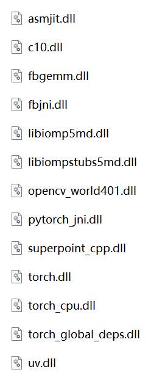

# SuperPointCPP

An implementation of SuperPoint C++ version and some new contributions

This repository was from [here](https://github.com/konan6915/SuperPointCPP). I modified the usage and parts of it.

Besides, I planned to develop new modules based on it.

## Demo

## Some Useful Links

### 1. Paper

- https://arxiv.org/abs/1712.07629

- https://nalinbendapudi.github.io/projects/open-vins/report.pdf

### 2. Code Project

- https://github.com/magicleap/SuperPointPretrainedNetwork

- https://github.com/rpautrat/SuperPoint

- https://github.com/konan6915/SuperPointCPP

## Test Platform

Windows 11 + Visual Studio 2019 + cmake 3.26.2

## Prerequisites

### 1. **libtorch** 

- I tested it on [libtorch](https://pytorch.org/get-started/locally/) cpu version 2.0.1. You can download it [here](https://download.pytorch.org/libtorch/cpu/libtorch-win-shared-with-deps-2.0.1%2Bcpu.zip).

### 2. **opencv** 

- I tested it on [opencv](https://opencv.org/) version 4.0.1. You can download it [here](https://github.com/opencv/opencv/releases/tag/4.0.1).

- Actually, you can choose my package [opencv](./opencv.zip).

## Build

### 1. Configure with suitable platform

### 2. Generate with correct library directory

- For libtorch, you should choose ***/libtorch/share/cmake/Torch**.

- And for opencv, you should choose ***/opencv/x64/vc15/lib**.

### 3. Compile the whole project

- I tested the mode "RelWithDebInfo".

### 4. Add dll for running

- You should put dlls below in the build directory **./build/RelWithDebInfo/**.

- 

## TODO List

- [ ] Modify PointTracker according to [PyTorch version](https://github.com/magicleap/SuperPointPretrainedNetwork).

- [ ] Integrate the new frontend to our sensor fusion framework.
